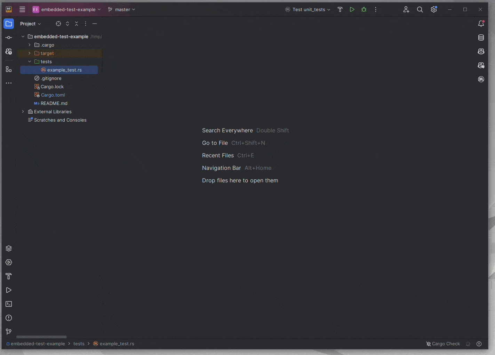

# Embedded Test

[](https://crates.io/crates/embedded-test)
[](https://docs.rs/embedded-test)


The embedded-test library provides a test harness for embedded systems (riscv, arm and xtensa).
Use this library on the target together with [probe-rs](https://probe.rs/) on the host to run unit + integration tests
on your embedded device.

[probe-rs](https://probe.rs/)  together with embedded-test provide a (libtest compatible) test runner, which will:

1. Read information about the available tests directly from the ELF file
2. Flash all the tests to the device in one go (via the `probe-rs run` command)
3. In turn for each testcase:
    - Reset the device
    - Signal to the device (via semihosting SYS_GET_CMDLINE) which test to run
    - Wait for the device to signal that the test completed successfully or with error (via semihosting SYS_EXIT)
4. Report the results

Since the test runner (`probe-rs run`) is libtest compatible (
using [libtest-mimic](https://crates.io/crates/libtest-mimic)), you can use intellij or vscode to run individual tests
with the click of a button.



## Features

* Runs each test case individually, and resets the device between each test case
* Supports an init function which will be called before each test case and can pass state to the test cases
* Supports async test and init functions (needs feature `embassy`)
* Support `#[should_panic]`, `#[ignore]` and `#[timeout(<seconds>)]` attributes for each test case

## Usage

Add the following to your `Cargo.toml`:

```toml
[dependencies]
embedded-test = { version = "0.7.0-alpha.1" }

[lib]
harness = false # Important: As we bring our own test harness for all tests

[[test]]
name = "example_integration_test"
harness = false

[[bin]]
name = "example_binary"
test = false # Unless you want to add unit tests to the binary
```

<sup>Want to move embedded-test to `[dev-dependencies]`? Look
at [embedded-test-linker-script](https://crates.io/crates/embedded-test-linker-script).</sup>

Install the runner on your system:

```bash
cargo install probe-rs-tools
```

Setup probe-rs as the runner in your `.cargo/config.toml`. For example:

```toml
[target.thumbv7em-none-eabihf]
runner = "probe-rs run --chip STM32F767ZITx"
# `probe-rs run` will autodetect whether the elf to flash is a normal firmware or a test binary
```

Add the following to your `build.rs` file:

```rust
fn main() {
    println!("cargo::rustc-link-arg=-Tembedded-test.x");
}
```

Then you can run your tests with `cargo test` or use the button in vscode/intellij.

Having trouble setting up? Checkout out
the [FAQ and common Errors](https://github.com/probe-rs/embedded-test/wiki/FAQ-and-common-Errors) Wiki page.

## Example Test (e.g. `tests/example_test.rs`)

Check the [example folder](https://github.com/probe-rs/embedded-test/tree/master/examples)
for a complete example project for stm32/esp32.

```rust
#![no_std]
#![no_main]

#[cfg(test)]
#[embedded_test::tests]
mod tests {
    use stm32f7xx_hal::pac::Peripherals;

    // An optional init function which is called before every test
    // Asyncness is optional, so is the return value
    #[init]
    async fn init() -> Peripherals {
        Peripherals::take().unwrap()
    }

    // Tests can be async (needs feature `embassy`)
    // Tests can take the state returned by the init function (optional)
    #[test]
    async fn takes_state(_state: Peripherals) {
        assert!(true)
    }

    // Tests can be conditionally enabled (with a cfg attribute)
    #[test]
    #[cfg(feature = "log")]
    fn log() {
        rtt_target::rtt_init_log!();
        log::info!("Hello, log!");
        assert!(true)
    }

    // Tests can be ignored with the #[ignore] attribute
    #[test]
    #[ignore]
    fn it_works_ignored() {
        assert!(false)
    }

    // Tests can fail with a custom error message by returning a Result
    #[test]
    fn it_fails_with_err() -> Result<(), &'static str> {
        Err("It failed because ...")
    }

    // Tests can be annotated with #[should_panic] if they are expected to panic
    #[test]
    #[should_panic]
    fn it_passes() {
        assert!(false)
    }

    // Tests can be annotated with #[timeout(<secs>)] to change the default timeout of 60s
    #[test]
    #[timeout(10)]
    fn it_timeouts() {
        loop {} // should run into the 10s timeout
    }
}
```

## Configuration features

| Feature              | Default? | Description                                                                                                                                                                                   |
|----------------------|----------|-----------------------------------------------------------------------------------------------------------------------------------------------------------------------------------------------|
| `panic-handler`      | Yes      | Defines a panic-handler which will invoke `semihosting::process::abort()` on panic                                                                                                            |
| `defmt`              | No       | Prints testcase exit result to defmt. You'll need to setup your defmt `#[global_logger]` yourself (e.g. `#[embedded_test::setup] fn setup() {rtt_target::rtt_init_defmt!()}`) .               |
| `log`                | No       | Prints testcase exit result to log. You'll need to setup your logging sink yourself (e.g. `#[embedded_test::setup] fn setup() {rtt_target::rtt_init_log!()}`)                                 |
| `embassy`            | No       | Enables async test and init functions. Note: You need to enable at least one executor feature on the embassy-executor crate unless you are using the `external-executor` feature.             |
| `external-executor`  | No       | Allows you to bring your own embassy executor which you need to pass to the `#[tests]` macro (e.g. `#[embedded_test::tests(executor = esp_hal::embassy::executor::thread::Executor::new())]`) |
| `xtensa-semihosting` | No       | Enables semihosting for xtensa targets.                                                                                                                                                       |
| `ariel-os`           | No       | Enables [Ariel OS](https://ariel-os.github.io/ariel-os/dev/docs/book/testing.html) integration.                                                                                               |

Please also note the doc for
the [Attribute Macro embedded_test::tests](https://docs.rs/embedded-test/latest/embedded_test/attr.tests.html).

## License

Licensed under either of:

- [Apache License, Version 2.0](http://www.apache.org/licenses/LICENSE-2.0)
- [MIT license](http://opensource.org/licenses/MIT)

at your option.

### Contribution

Unless you explicitly state otherwise, any contribution intentionally submitted for inclusion in
the work by you, as defined in the Apache-2.0 license, shall be dual licensed as above, without
any additional terms or conditions.

